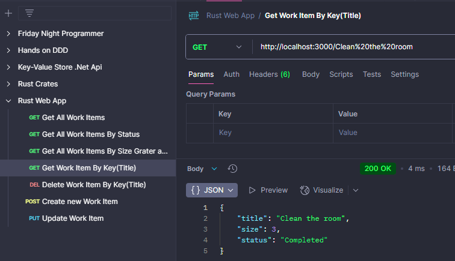

# Rust Web App

Rust programlama dili kullanılarak web uygulaması geliştirme sürecinin tecrübe edildiği repodur. Kaynak olarak Packt yayınlarınn [Rust Web Programming: A hands-on guide to Rust for modern web development, with microservices and nanoservices , Third Edition ](https://www.packtpub.com/en-us/product/rust-web-programming-9781835887769) isimli kitabından yararlanılmaktadır.

## Senaryo

Senaryo da planlı işler ele alınır. Her bir planlı işin kısa bir başlığı, Scrum yaklaşımındakine benzer Fibonacci temelli büyüklüğü _(1,2,3,5,8,13 gibi)_ ve durum bilgisi _(Ready, In-Progress, Completed)_ vardır.

## Proje Yapısı

Günden günde gelişen proje yapısı aşağıdaki ağaç yapısı ile ifade edilebilir.

- **Root**
  - **Core** (Binary. CLI ile Work Item ekleme, silme, listeleme gibi özellikler de içerir, api desteği sunar)
  - **Dal** (Library. Data Access Layer görevini üstlenir)
  - **Server** (Binary. Actix-Web framework'ü kullanan, asenkron operasyonlarda Tokio küfesi ile çalışan web server)

## Day_00

CLI komutları ile Work Item'lar eklenebilmelidir. Ayrıca web server başlatılabilmeli ve localhost:3000 adresine erişildiğinde index sayfası gelmelidir.

```bash
#core programında
cargo run -- create -t "Study 25 minutes for Rust" -v 5 -s "completed"
cargo run -- create -t "Develop issue request form" -v 13 -s "completed"
cargo run -- create -t "Clean the room" -v 3 -s "completed"
cargo run -- create -t "Run for 10 Km in 2 hour" -v 8 -s "Ready"
cargo run -- create -t "Read 15 pages from novel" -v 1 -s "InProgress"

#Web Server'ı çalıştırmak için
# root klasörde
cargo run -p server

# veya server klasöründeyken
cargo run
```

## Day_01

Server çalıştırıldıktan sonra index sayfasına ulaşıldığında, CLI uygulamasında örnek olarak eklenmiş work item listeleri statü bilgisine göre ayrılmış şekilde listelenebilmelidir.

Örnek;


Ayrıca yeni bir kayıt eklemek için POST ve key bazlı GET işlemleri yapılabilmelidir. API tarafı için gerekli örnek request'ler [Postman Collection dosyasında](./Rust%20Web%20App.postman_collection.json) yer almaktadır.

## Day_02

Hata nesnelerinin tüm modüllerde ortak yönetimini kolaylaştırmak için genel bir modülün yazılması ele alınır. Bu amaçla planner içerisindeki rust paketleri tarafından da ortak kullanılabilecek shared isimli üst paket kullanılmaktadır.

Gün sonunda servis bazlı hata mesajlarının shared paketindeki error türü ile yönetilmesi beklenir.

```bash
# feature bazlı testleri yürütmek için
# (Örneğin 'actix' feature'ına dahil testleri)
# aşağıdaki cargo komutu ile ilerlenebilir
cargo test --features actix
```

## Day_03

Hata nesnelerinin modüllere uyarlanmasını takiben server api tarafındaki tüm CRUD _(Create, Read, Update, Delete)_ operasyonlarının başarılı şekilde icra edilmesi beklenir.





Ayrıca header bazlı çalışan basit bir token mekanizması da sisteme entegre edilir.